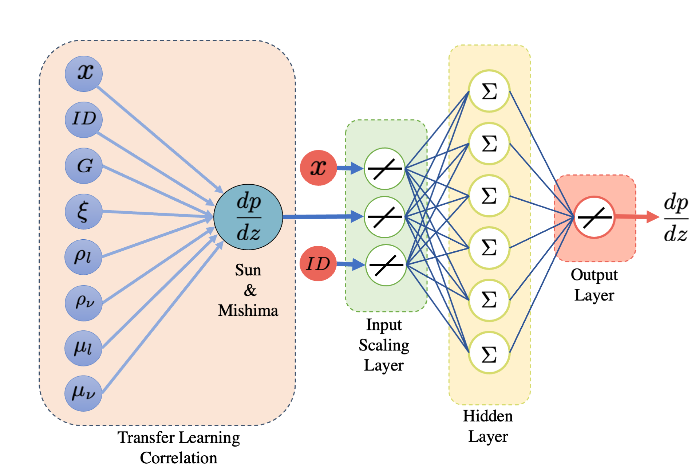

# CoINN: Correlated-informed neural networks: a new machine learning framework to predict pressure drop in micro-channels

Accurate pressure drop estimation in forced boiling phenomena is important during the thermal analysis and the geometric design of cryogenic heat exchangers. However, current methods to predict the pressure drop have one of two problems: lack of accuracy or generalization to different situations. In this work, we present the correlated-informed neural networks (CoINN), a new paradigm in applying the artificial neural network (ANN) technique combined with a successful pressure drop correlation as a mapping tool to predict the pressure drop of zeotropic mixtures in micro-channels. The proposed approach is inspired by Transfer Learning, highly used in deep learning problems with reduced datasets. Our method improves the ANN performance by transferring the knowledge of the Sun & Mishima correlation for the pressure drop to the ANN. The correlation having physical and phenomenological implications for the pressure drop in micro-channels considerably improves the performance and generalization capabilities of the ANN. The final architecture consists of three inputs: the mixture vapor quality, the micro-channel inner diameter, and the available pressure drop correlation. The results show the benefits gained using the correlated-informed approach predicting experimental data used for training and a posterior test with a mean relative error (mre) of 6%, lower than the Sun & Mishima correlation of 13%. Additionally, this approach can be extended to other mixtures and experimental settings, a missing feature in other approaches for mapping correlations using ANNs for heat transfer applications.

# The Files:
* Paper examples.ipynb contains the development of the main figures in the paper. The 37 experimental cases of Barraza et al. and the results of Keniar et al.
* coinn.py contains the structure of the ANN 
* correlation_sun.py is the Sun & Mishima correlation with the lowest error for the pressure drop between the different correlations.

CoINN architecture components (left) it is the transfer learning component, the Sun & Mishima correlation, combined with the quality x and the inner diameter ID are the inputs of the ANN; (right) it comprises an input scaling layer, a hidden layer with 6 neurons, and tanh as activation function and an output scaling layer.
